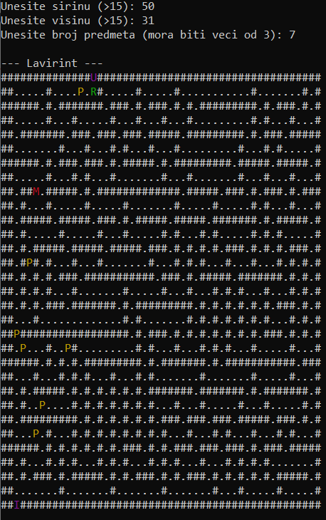
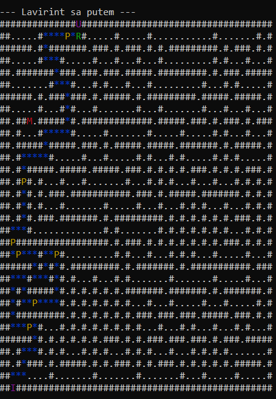
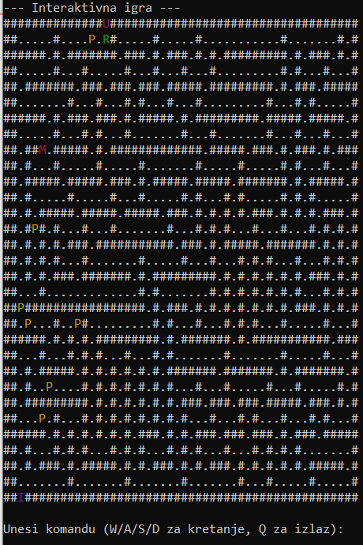
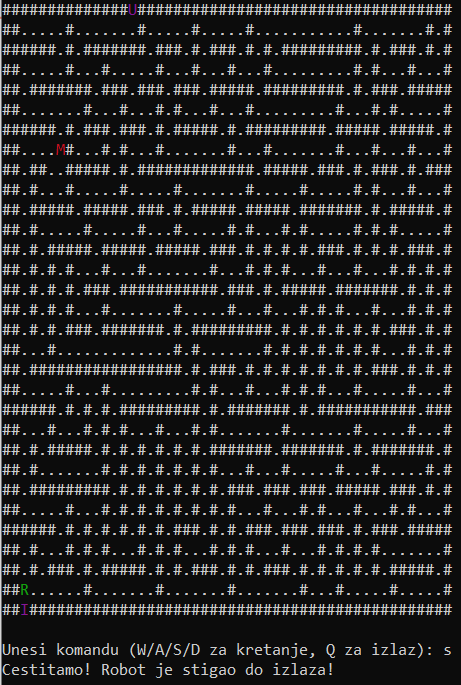

# Robot in the Labyrinth of Knossos

A console-based game in C++ where the user controls a robot navigating a randomly generated maze, avoiding the Minotaur and collecting items with special effects, inspired by the myth of the Labyrinth of Knossos.

---

## Gameplay

The robot must reach the exit while avoiding the Minotaur. Items with special effects can be collected along the way, each effect lasts **3 moves**.

| Item | Effect |
|---|---|
| Sword | Destroy the Minotaur |
| Shield | Defend against the Minotaur's attack |
| Hammer | Walk through walls |
| Fog of War | Visibility reduced to a 3×3 area |

The game ends when the robot reaches the exit, is defeated by the Minotaur, or the user presses `Q`.

---

## Key Concepts

- **Maze generation** — iterative DFS algorithm guarantees a solvable maze every time
- **Shortest path** — BFS highlights the optimal route from entry to exit
- **OOP design** — abstract `Item` class with `Sword`, `Shield`, `Hammer` and `Fog` subclasses using polymorphism
- **Colored console output** — robot (green), Minotaur (red), items (yellow), entry/exit (purple)

---

## Project Structure

```
├── Game.cpp / Game.h          # Game loop, robot and Minotaur logic
├── Item.h                     # Abstract item base class + Sword, Shield, Hammer, Fog
├── MazeGenerator.cpp / .h     # Maze generation
├── main.cpp                   # Entry point
└── game_result.txt            # Auto-generated game outcome file
```
---

## Getting Started

Enter maze dimensions (both must be > 15) and number of items (> 3) when prompted.

**Controls:** `W` `A` `S` `D` to move, `Q` to quit.

---

## Performance — Maze Generation Times

| Width | Height | Items | Time (s) |
|---|---|---|---|
| 16 | 16 | 4 | 0.000284 |
| 40 | 20 | 10 | 0.000822 |
| 150 | 100 | 25 | 0.016299 |
| 300 | 500 | 40 | 0.165967 |

---

## Screenshots

<table>
  <tr>
    <td></td>
    <td></td>
  </tr>
  <tr>
    <td></td>
    <td></td>
  </tr>
</table>
